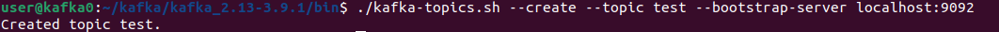
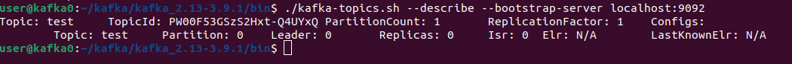
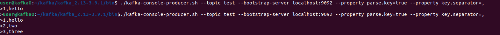
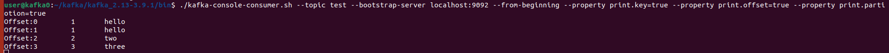

# Запуск Kafka

## Цель
Научиться самостоятельно запускать Kafka (быстрый старт).

# Отчет по выполнению задания

Выполним установку kafka на Ubuntu

* Устанавливаем java jdk: ```sudo apt install openjdk-21-jdk```
* Скачиваем kafka:
   ```wget https://downloads.apache.org/kafka/3.9.1/kafka_2.13-3.9.1.tgz```
* Распаковываем скаченный архив:
   ```tar xzf kafka_2.13-3.9.1.tgz```
* Переходим в каталог kafka_2.13-3.9.1 и запускаем Zookeeper:
   ```cd kafka_2.13-3.9.1```
   ```bin/zookeeper-server-start.sh config/zookeeper.properties```
   В новом терминале запускаем kafka:
   ```bin/kafka-server-start.sh config/server.properties```
* В новом терминале переходим в каталог bin ```cd kafka_2.13-3.9.1/bin``` и создаем топик test:
   ```./kafka-topics.sh --create --topic test --bootstrap-server localhost:9092```
  
* Посмотрим на описание топика:
  ```./kafka-topics.sh --describe --bootstrap-server localhost:9092```
  
* Записываем в топик test несколько сообщений: 
  ```./kafka-console-producer.sh --topic test --bootstrap-server localhost:9092 --property parse.key=true --property key.separator=,```
  

* Прочитаем сообщения из топика test:
  ```./kafka-console-consumer.sh --topic test --bootstrap-server localhost:9092 --from-beginning --property print.key=true --property print.offset=true --property print.partiotion=true```
  