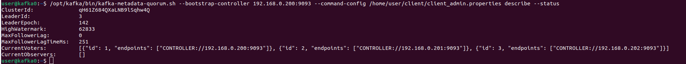
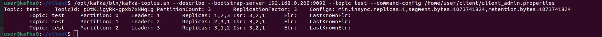
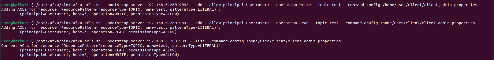
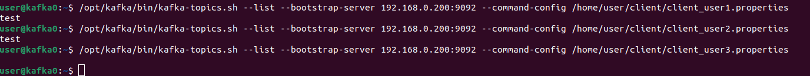
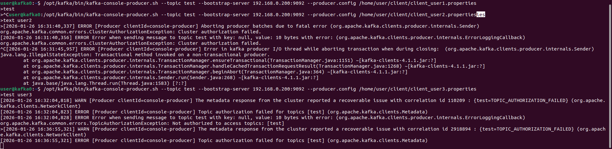
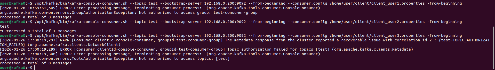

# kraft и kafka. Настройка безопасности

## Цель
Научиться разворачивать kafka с помощью kraft и самостоятельно настраивать безопасность.

## Описание/Пошаговая инструкция выполнения домашнего задания:
Развернуть Kafka с Kraft и настроить безопасность:

* Запустить Kafka с Kraft:
  Сгенерировать UUID кластера
  Отформатировать папки для журналов
* Запустить брокер
* Настроить аутентификацию SASL/PLAIN. Создать трёх пользователей с произвольными именами.
* Настроить авторизацию. Создать топик. Первому пользователю выдать права на запись в этот топик. Второму пользователю выдать права на чтение этого топика. Третьему пользователю не выдавать никаких прав на этот топик.
* От имени каждого пользователя выполнить команды:
  Получить список топиков
  Записать сообщения в топик
  Прочитать сообщения из топика


# Отчет по выполнению задания

## Установка и настройка конфигурации

Создали три виртуальные машины virtualbox ubuntu

| узел     | ip адрес      |
|----------|---------------|
| kafka0   | 192.168.0.200 | 
| kafka1   | 192.168.0.201 | 
| kafka2   | 192.168.0.202 |

Скачиваем kafka:
  ```wget https://downloads.apache.org/kafka/4.1.1/kafka_2.13-4.1.1.tgz```
Распаковываем скаченный архив:
    ```tar xzf kafka_2.13-4.1.1.tgz```

Выполняем на всех узлах
Создаём пользователя для Kafka

```
sudo useradd -s /sbin/nologin --system kafka
sudo mkdir -p /opt/kafka
sudo chown kafka:kafka /opt/kafka
```

Перемещаем
```
sudo mv kafka_2.13-4.1.1/* /opt/kafka/
sudo chown -R kafka:kafka /opt/kafka
```

Создаём директории для данных
```
sudo mkdir -p /var/lib/kafka-logs
sudo chown -R kafka:kafka /var/lib/kafka-logs
```

В KRaft всем узлам нужен одинаковый cluster ID. Генерируем его на одном из узлов:
Переходим в директорию Kafka
```
cd /opt/kafka
```

Генерируем cluster ID
```
./bin/kafka-storage.sh random-uuid
```
```
qH61Z684QXaLNB9lSqhw4Q
```


На всех узлах редактируем

```sudo nano /opt/kafka/config/server.properties```

[конфиг для kafka0](res/kafka0/server.properties)
[конфиг для kafka1](res/kafka1/server.properties)
[конфиг для kafka2](res/kafka2/server.properties)

На каждом узле необходимо инициализировать хранилище с тем же cluster ID:
Переходим в директорию Kafka
```
cd /opt/kafka
```

Инициализируем хранилище (замените на ваш cluster ID)
```
sudo ./bin/kafka-storage.sh format -t qH61Z684QXaLNB9lSqhw4Q -c config/server.properties
sudo chown -R kafka:kafka /var/lib/kafka-logs
```

Проверяем создание метаданных
```
ls -la /var/lib/kafka-logs/
```

## SASL/PLAIN

Создаем конфигурационный файл kafka_server_jaas.conf JAAS с тремя пользователями

```
KafkaServer {
    org.apache.kafka.common.security.plain.PlainLoginModule required
    username="admin"
    password="password"
    user_admin="password"
    user_user1="pass1"
    user_user2="pass2"
    user_user3="pass3";
};

KafkaClient {
    org.apache.kafka.common.security.plain.PlainLoginModule required
    username="admin"
    password="password";
};
```

Задаем переменную окружения

```
export KAFKA_OPTS="-Djava.security.auth.login.config=/opt/kafka/kafka_server_jaas.conf"
sudo chown -R kafka:kafka /opt/kafka/kafka_server_jaas.conf
```

## Создание systemd службы

Делаем автоматический запуск kafka. На каждом узле создаём systemd unit

```sudo nano /etc/systemd/system/kafka.service```
[kafka.service](res/kafka.service)

Перезагружаем systemd

```sudo systemctl daemon-reload```

Включаем автозапуск
```sudo systemctl enable kafka```

Запускаем сервис
```sudo systemctl start kafka```

Проверяем статус
```sudo systemctl status kafka```

Смотрим логи
```sudo journalctl -n 1000 -u kafka -f```


Посмотрим состояние кластера

```
/opt/kafka/bin/kafka-metadata-quorum.sh --bootstrap-controller 192.168.0.200:9093 --command-config /home/user/client/client_admin.properties describe --status
```




## Списки контроля доступа ACL

Создаем файлы с параметрами подключения пользователей


Создаем топик test командой

```
/opt/kafka/bin/kafka-topics.sh --create --topic test --bootstrap-server 192.168.0.200:9092 --command-config /home/user/client/client_admin.properties
```

Посмотрим список топиков

```
/opt/kafka/bin/kafka-topics.sh --list --bootstrap-server 192.168.0.200:9092 --command-config /home/user/client/client_admin.properties
/opt/kafka/bin/kafka-topics.sh --describe --bootstrap-server 192.168.0.200:9092 --topic test --command-config /home/user/client/client_admin.properties
```





Первому пользователю выдаем права на запись в топик test. 
Второму пользователю выдать права на чтение топика test. 
Третьему пользователю не выдавать никаких прав на топик test.

```
/opt/kafka/bin/kafka-acls.sh --bootstrap-server 192.168.0.200:9092 --add --allow-principal User:user1 --operation Write --topic test --command-config /home/user/client/client_admin.properties
/opt/kafka/bin/kafka-acls.sh --bootstrap-server 192.168.0.200:9092 --add --allow-principal User:user2 --operation Read --topic test --group '*' --command-config /home/user/client/client_admin.properties

/opt/kafka/bin/kafka-acls.sh --bootstrap-server 192.168.0.200:9092 --list --command-config /home/user/client/client_admin.properties
```
Получили вывод




Получаем список топиков от user1, user2, user3

```
/opt/kafka/bin/kafka-topics.sh --list --bootstrap-server 192.168.0.200:9092 --command-config /home/user/client/client_user1.properties
/opt/kafka/bin/kafka-topics.sh --list --bootstrap-server 192.168.0.200:9092 --command-config /home/user/client/client_user2.properties
/opt/kafka/bin/kafka-topics.sh --list --bootstrap-server 192.168.0.200:9092 --command-config /home/user/client/client_user3.properties
```




Записываем сообщение разными пользователями

```
/opt/kafka/bin/kafka-console-producer.sh --topic test --bootstrap-server 192.168.0.200:9092 --producer.config /home/user/client/client_user1.properties
/opt/kafka/bin/kafka-console-producer.sh --topic test --bootstrap-server 192.168.0.200:9092 --producer.config /home/user/client/client_user2.properties
/opt/kafka/bin/kafka-console-producer.sh --topic test --bootstrap-server 192.168.0.200:9092 --producer.config /home/user/client/client_user3.properties 
```




Читаем сообещение

```
/opt/kafka/bin/kafka-console-consumer.sh --topic test --bootstrap-server 192.168.0.200:9092 --from-beginning --consumer.config /home/user/client/client_user1.properties -from-beginning
/opt/kafka/bin/kafka-console-consumer.sh --topic test --bootstrap-server 192.168.0.200:9092 --from-beginning --consumer.config /home/user/client/client_user2.properties -from-beginning
/opt/kafka/bin/kafka-console-consumer.sh --topic test --bootstrap-server 192.168.0.200:9092 --from-beginning --consumer.config /home/user/client/client_user3.properties -from-beginning
```

